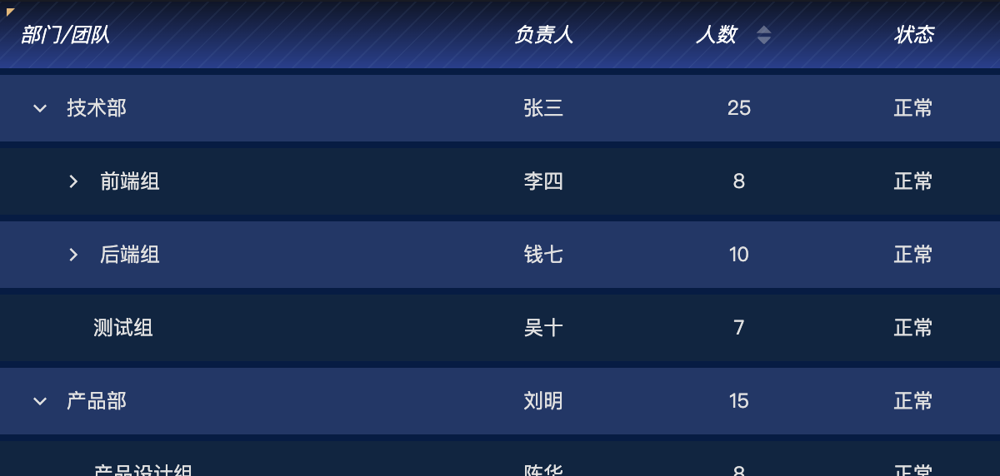

# Table 表格组件

功能丰富的数据表格组件，支持多级表头、列固定、排序、自动滚动等特性。

## 功能特性

- ✅ 多级表头（通过 `children` 嵌套定义）
- ✅ 列固定（支持左侧/右侧固定）
- ✅ 列排序（支持自定义排序脚本）
- ✅ 序号列（可配置起始值、对齐方式、固定）
- ✅ 展开行（支持自定义HTML内容）
- ✅ 树形表格
- ✅ 斑马纹
- ✅ 行高亮（hover、点击高亮）
- ✅ 自定义事件（行点击、单元格点击）
- ✅ 自定义渲染（表头/单元格支持图片、文本、HTML/SVG）
- ✅ 动态样式（表头单元格、行、单元格样式脚本）



## 目录结构

```
table/
├── assets/
│   └── logo.png              # 组件图标
├── components/
│   ├── EmptyState.jsx        # 空数据状态组件
│   ├── Icon.jsx              # 图标组件
│   ├── RenderElement.jsx     # 渲染元素组件
│   ├── TableBody.jsx         # 表体组件
│   ├── TableHeader.jsx       # 表头组件
│   └── index.js              # 组件导出
├── config/
│   ├── main.json             # 组件配置
│   └── main.data.json        # 示例数据
├── hooks/
│   ├── useAutoScroll.js      # 自动滚动 Hook
│   ├── useTableConfig.js     # 配置解析 Hook
│   ├── useTableEvents.js     # 事件处理 Hook
│   ├── useTableSort.js       # 排序逻辑 Hook
│   └── index.js              # Hooks 导出
├── styles/
│   └── index.module.css      # 样式文件
├── utils/
│   ├── index.js              # 工具函数
│   ├── bind-children.js      # 子组件绑定
│   └── reduce-config.js      # 配置处理
├── index.jsx                 # 组件入口
└── README.md                 # 组件文档
```

## 配置说明

### 全局配置 (tableStyle)

| 配置项 | 类型 | 默认值 | 说明 |
|--------|------|--------|------|
| stripe | boolean | false | 斑马纹 |
| border | boolean | true | 显示边框 |
| showHeader | boolean | true | 显示表头 |
| highlightCurrentRow | boolean | false | 点击高亮当前行 |
| emptyText | string | "暂无数据" | 空数据提示文本 |

### 序号列配置 (indexColumn)

| 配置项 | 类型 | 默认值 | 说明 |
|--------|------|--------|------|
| show | boolean | true | 显示序号列 |
| indexLabel | string | "序号" | 序号列标题 |
| indexStart | number | 1 | 起始值 |
| indexWidth | number | 60 | 列宽 |
| indexAlign | string | "center" | 对齐方式 (left/center/right) |
| indexFixed | boolean | false | 固定到左侧 |

### 表头配置 (headerStyle)

| 配置项 | 类型 | 默认值 | 说明 |
|--------|------|--------|------|
| headerHeight | number | 40 | 表头高度 |
| headerBgColor | color | #1a1a2e | 背景色 |
| headerTextStyle | textStyle | - | 文字样式 |

### 行配置 (bodyStyle)

| 配置项 | 类型 | 默认值 | 说明 |
|--------|------|--------|------|
| rowHeight | number | 40 | 行高 |
| bodyBgColor | color | #16213e | 背景色 |
| bodyTextStyle | textStyle | - | 文字样式 |
| stripeBgColor | color | #1a1a2e | 斑马纹背景色 |
| hoverBgColor | color | #2a3f5f | 悬停背景色 |
| currentRowBgColor | color | #304d6d | 高亮行背景色 |
| borderColor | color | #2a2a4a | 边框颜色 |

### 列配置 (columnConfig)

列定义使用 JSON 数组格式：

```json
[
  {
    "prop": "id",
    "label": "ID",
    "width": 60,
    "align": "center",
    "fixed": "left",
    "sortable": true
  },
  {
    "label": "地址信息",
    "children": [
      { "prop": "province", "label": "省份", "width": 100 },
      { "prop": "city", "label": "城市", "width": 100 }
    ]
  }
]
```

#### 列属性说明

| 属性 | 类型 | 说明 |
|------|------|------|
| prop | string | 字段名（对应数据中的 key） |
| label | string | 显示名称（支持 HTML，如 `<br/>` 换行） |
| width | number | 列宽（像素） |
| minWidth | number | 最小列宽 |
| align | string | 内容对齐方式 (left/center/right) |
| headerAlign | string | 表头对齐方式 |
| fixed | string/boolean | 固定列 (left/right/true) |
| sortable | boolean | 是否可排序 |
| sortScript | string | 自定义排序脚本 |
| children | array | 子列（用于多级表头） |
| showOverflowTooltip | boolean | 内容溢出时显示 tooltip |

### 滚动配置 (scrollConfig)

| 配置项 | 类型 | 默认值 | 说明 |
|--------|------|--------|------|
| autoScroll | boolean | false | 自动滚动 |
| scrollSpeed | number | 50 | 滚动速度（ms） |
| scrollPauseOnHover | boolean | true | 悬停暂停 |

### 滚动条样式配置 (scrollbarColor)

自定义表格滚动条滑块的颜色（包含透明度）。

| 配置项 | 类型 | 默认值 | 说明 |
|--------|------|--------|------|
| scrollbarColor | color | #E6F7FF | 滑块颜色（颜色选择器包含透明度设置） |

**注意事项：**
- 滚动条样式对 Webkit 内核浏览器（Chrome、Safari、Edge）和 Firefox 完全生效
- 颜色选择器右侧的百分比控制透明度
- 鼠标悬停时会自动调整为 80% 透明度
- 滚动条宽度固定为 6px，圆角固定为 3px

### 展开行配置 (expandConfig)

展开行功能允许点击行时在下方展示详细信息，支持自定义HTML内容渲染。

| 配置项 | 类型 | 默认值 | 说明 |
|--------|------|--------|------|
| enableExpand | boolean | false | 启用展开行 |
| expandIconColumn | string | "separate" | 展开图标位置（"first": 第一列，"separate": 单独列） |
| expandColumnWidth | number | 48 | 展开列宽度（仅 separate 模式） |
| expandColumnLabel | string | "" | 展开列标题（仅 separate 模式） |
| accordion | boolean | false | 手风琴模式（同时只能展开一行） |
| defaultExpandAll | boolean | false | 默认全部展开 |
| expandIcon | html | - | 展开图标（HTML/SVG） |
| collapseIcon | html | - | 收起图标（HTML/SVG） |
| expandRenderScript | code | - | 展开内容渲染函数 |

#### 展开内容渲染函数

展开内容渲染函数用于生成展开后显示的HTML内容。

**函数签名：**
```javascript
function(row, rowIndex) {
  // row: 当前行数据对象
  // rowIndex: 行索引（从0开始）
  // 返回: HTML字符串
  return `<div>...</div>`
}
```

**示例1：显示行详细信息**
```javascript
return `
  <div style="padding: 20px; background: #f5f7fa;">
    <h3 style="margin: 0 0 15px 0; color: #303133;">详细信息</h3>
    <div style="display: grid; grid-template-columns: repeat(2, 1fr); gap: 10px;">
      <div><strong>ID:</strong> ${row.id}</div>
      <div><strong>姓名:</strong> ${row.name}</div>
      <div><strong>年龄:</strong> ${row.age}</div>
      <div><strong>城市:</strong> ${row.city}</div>
    </div>
  </div>
`
```

**示例2：显示富文本内容**
```javascript
return `
  <div style="padding: 20px; line-height: 1.6;">
    <p>${row.description || '暂无描述'}</p>
    ${row.imageUrl ? `` : ''}
  </div>
`
```

**示例3：条件渲染**
```javascript
if (row.hasDetails) {
  return `<div style="padding: 20px;">${row.details}</div>`
}
return `<div style="padding: 20px; color: #909399;">该项无详细信息</div>`
```

#### 图标位置模式

**单独列模式 (separate)**：
- 在表格最左侧创建一个专门的展开列
- 适合：需要明确的展开/收起操作区域
- 特点：独立的固定列，不影响数据列

**第一列模式 (first)**：
- 在表格第一列（可能是序号列或第一个数据列）内嵌展开图标
- 适合：节省空间，图标与数据在同一列
- 特点：图标显示在单元格内容前方

### 树形表格配置 (treeConfig)

树形表格功能用于展示具有层级关系的数据，支持展开/收起子节点、懒加载等特性。

**注意：树形表格与展开行功能可以同时使用，但作用不同：**
- 树形表格：展示层级结构数据（如组织架构、文件目录）
- 展开行：显示单行详细信息（如详情面板）

| 配置项 | 类型 | 默认值 | 说明 |
|--------|------|--------|------|
| enableTree | boolean | false | 启用树形表格 |
| childrenField | string | "children" | 数据中子级数组的字段名 |
| treeColumn | string | "name" | 显示树形结构的列（字段 prop 值） |
| indent | number | 20 | 每层级缩进像素 |
| defaultExpandAll | boolean | false | 默认全部展开 |
| defaultExpandLevel | number | 1 | 默认展开层级（0=全部收起，-1=全部展开） |
| treeExpandIcon | html | - | 展开图标（HTML/SVG） |
| treeCollapseIcon | html | - | 收起图标（HTML/SVG） |
| lazy | boolean | false | 启用懒加载 |
| lazyLoadScript | code | - | 懒加载函数 |

#### 树形数据格式

**普通模式（非懒加载）**：

数据中需要包含 `children` 字段（或自定义的 `childrenField`）来表示子节点。

```javascript
{
  "data": [
    {
      "id": 1,
      "name": "一级节点1",
      "children": [
        {
          "id": 11,
          "name": "二级节点1-1",
          "children": [
            { "id": 111, "name": "三级节点1-1-1" }
          ]
        },
        { "id": 12, "name": "二级节点1-2" }
      ]
    },
    {
      "id": 2,
      "name": "一级节点2",
      "children": [
        { "id": 21, "name": "二级节点2-1" }
      ]
    }
  ]
}
```

**懒加载模式**：

数据中使用 `hasChildren` 字段标识节点是否有子节点。

```javascript
{
  "data": [
    { "id": 1, "name": "一级节点1", "hasChildren": true },
    { "id": 2, "name": "一级节点2", "hasChildren": false }
  ]
}
```

#### 懒加载函数

懒加载函数在用户点击展开图标时调用，用于异步加载子节点数据。

**函数签名：**
```javascript
function(row, resolve) {
  // row: 当前节点数据对象
  // resolve: 回调函数，传入子节点数据数组
}
```

**示例1：模拟异步加载**
```javascript
setTimeout(() => {
  const children = [
    { id: `${row.id}-1`, name: `${row.name}-子节点1`, hasChildren: true },
    { id: `${row.id}-2`, name: `${row.name}-子节点2`, hasChildren: false }
  ];
  resolve(children);
}, 500);
```

**示例2：通过API加载**
```javascript
fetch(`/api/tree/children?parentId=${row.id}`)
  .then(res => res.json())
  .then(data => {
    resolve(data.children || []);
  })
  .catch(err => {
    console.error('加载失败:', err);
    resolve([]);
  });
```

**示例3：根据层级生成数据**
```javascript
// 获取当前层级（从元数据中）
const level = row.__treeLevel__ || 0;

// 根据层级生成不同数量的子节点
if (level < 3) {
  const count = 3 - level;
  const children = Array.from({ length: count }, (_, i) => ({
    id: `${row.id}-${i + 1}`,
    name: `层级${level + 1}-节点${i + 1}`,
    hasChildren: level < 2
  }));
  setTimeout(() => resolve(children), 300);
} else {
  resolve([]);
}
```

#### 树形列配置

树形图标和缩进会自动显示在 `treeColumn` 指定的列中：

```json
{
  "treeConfig": {
    "enableTree": true,
    "childrenField": "children",
    "treeColumn": "name",
    "indent": 20
  },
  "columns": [
    { "prop": "id", "label": "ID", "width": 60 },
    { "prop": "name", "label": "名称", "width": 200 },
    { "prop": "status", "label": "状态", "width": 100 }
  ]
}
```

在上面的例子中，树形结构会显示在 "名称" 列中。

#### 展开控制

**默认展开层级：**
- `defaultExpandAll: true` - 展开所有节点
- `defaultExpandLevel: 1` - 展开第一层
- `defaultExpandLevel: 2` - 展开前两层
- `defaultExpandLevel: 0` - 全部收起
- `defaultExpandLevel: -1` - 全部展开（同 `defaultExpandAll`）

#### 树形表格与展开行结合使用

两个功能可以同时启用，实现既有层级结构又有详情展示的效果：

```json
{
  "treeConfig": {
    "enableTree": true,
    "treeColumn": "name"
  },
  "expandConfig": {
    "enableExpand": true,
    "expandIconColumn": "separate"
  }
}
```

在这种情况下：
- 树形图标：显示在 `treeColumn` 指定的列中，用于展开/收起子节点
- 展开图标：显示在单独列或第一列，用于展开/收起详情面板

### 高级样式配置 (advancedStyle)

支持类似 Element UI 的动态样式和自定义渲染配置，通过脚本函数动态计算样式或渲染内容。

配置结构：

```
advancedStyle/
├── header/               # 表头整体
│   └── headerStyle       # 样式脚本
├── headerCell/           # 表头单元格
│   ├── headerCellStyle   # 样式脚本
│   └── headerCellRender  # 渲染脚本
├── cell/                 # 数据单元格
│   ├── cellStyle         # 样式脚本
│   └── cellRender        # 渲染脚本
└── rowStyle/             # 数据行样式
    └── rowStyle          # 样式脚本
```

#### headerStyle - 表头整体样式

无可用变量，直接返回样式对象。适用于设置表头背景叠加效果（如条纹图案）。

```javascript
// 示例：添加条纹背景叠加（默认值）
return {
  background: `
    repeating-linear-gradient(135deg, rgba(127,170,212,0.078), rgba(127,170,212,0.078) 1px, transparent 1px, transparent 8px),
    var(--header-bg)
  `
};
```

#### headerCellStyle - 表头单元格样式

可用变量：
- `column` - 列配置对象
- `columnIndex` - 行内列索引
- `leafColumnIndex` - 全局叶子列索引

```javascript
// 示例：特定列设置不同颜色
if (column.prop === 'name') {
  return { color: '#409eff' };
}
return {};
```

#### headerCellRender - 表头单元格渲染

可用变量：
- `column` - 列配置对象
- `columnIndex` - 行内列索引
- `leafColumnIndex` - 全局叶子列索引

返回渲染配置对象，支持 `prefix`（前缀）、`suffix`（后缀）、`content`（内容替换）、`hideText`（隐藏原文字）。

**支持的元素类型：**

| 类型 | 属性 | 说明 |
|------|------|------|
| image | `src`, `width`, `height`, `style` | 图片（支持 URL、Base64、SVG data URI） |
| text | `content`, `style` | 文本 |
| html | `content`, `style` | HTML/SVG 内容 |

**位置配置（position）：**
- `inline` - 行内显示（默认）
- `topLeft` - 左上角
- `topRight` - 右上角
- `bottomLeft` - 左下角
- `bottomRight` - 右下角

```javascript
// 示例：全局第一个叶子列左上角添加红色三角形（使用 SVG）
if (leafColumnIndex === 0) {
  return {
    prefix: {
      type: 'html',
      position: 'topLeft',
      content: '<svg width="8" height="8"><polygon points="0,0 8,0 0,8" fill="#ff0000"/></svg>'
    }
  };
}
return {};
```

#### rowStyle - 行样式

可用变量：
- `row` - 行数据对象
- `rowIndex` - 行索引

```javascript
// 示例：根据数据状态设置行背景色
if (row.status === 'warning') {
  return { backgroundColor: '#fdf6ec' };
}
if (row.status === 'danger') {
  return { backgroundColor: '#fef0f0' };
}
return {};
```

#### cellStyle - 单元格样式

可用变量：
- `row` - 行数据对象
- `column` - 列配置对象
- `rowIndex` - 行索引
- `columnIndex` - 行内列索引
- `leafColumnIndex` - 全局叶子列索引

```javascript
// 示例：年龄大于30的显示红色
if (column.prop === 'age' && row.age > 30) {
  return { color: '#f56c6c' };
}
// 示例：金额为负数显示绿色
if (column.prop === 'amount' && row.amount < 0) {
  return { color: '#67c23a' };
}
return {};
```

#### cellRender - 单元格渲染

可用变量：
- `row` - 行数据对象
- `column` - 列配置对象
- `rowIndex` - 行索引
- `columnIndex` - 行内列索引
- `leafColumnIndex` - 全局叶子列索引
- `value` - 单元格原始值

返回渲染配置对象，支持 `prefix`（前缀）、`suffix`（后缀）、`content`（内容替换）、`hideText`（隐藏原文字）。

元素类型和位置配置同 `headerCellRender`。

```javascript
// 示例：排名列前三名显示奖牌图标
if (column.prop === 'rank') {
  const icons = {
    1: 'https://example.com/gold.png',
    2: 'https://example.com/silver.png',
    3: 'https://example.com/bronze.png'
  };
  if (icons[value]) {
    return {
      content: {
        type: 'image',
        src: icons[value],
        width: 24,
        height: 24
      },
      hideText: true
    };
  }
}
return {};
```

```javascript
// 示例：状态列添加图标前缀
if (column.prop === 'status') {
  const iconMap = {
    success: '<svg width="12" height="12"><circle cx="6" cy="6" r="5" fill="#67c23a"/></svg>',
    warning: '<svg width="12" height="12"><circle cx="6" cy="6" r="5" fill="#e6a23c"/></svg>',
    error: '<svg width="12" height="12"><circle cx="6" cy="6" r="5" fill="#f56c6c"/></svg>'
  };
  if (iconMap[value]) {
    return {
      prefix: {
        type: 'html',
        content: iconMap[value],
        style: { marginRight: '4px' }
      }
    };
  }
}
return {};
```

## 触发器事件

| 事件名 | 说明 | 回调参数 |
|--------|------|----------|
| rowClick | 点击行 | `{ row, rowIndex, data }` |
| cellClick | 点击单元格 | `{ row, column, rowIndex, colIndex, value, data }` |
| sortChange | 排序变化 | `{ prop, order, column, data }` |

## 使用示例

### 基础表格

```json
{
  "columns": [
    { "prop": "id", "label": "ID", "width": 60 },
    { "prop": "name", "label": "姓名", "width": 100 },
    { "prop": "age", "label": "年龄", "width": 80 }
  ]
}
```

### 多级表头

```json
{
  "columns": [
    { "prop": "id", "label": "ID", "width": 60 },
    {
      "label": "个人信息",
      "children": [
        { "prop": "name", "label": "姓名", "width": 100 },
        { "prop": "age", "label": "年龄", "width": 80 }
      ]
    }
  ]
}
```

### 固定列

```json
{
  "columns": [
    { "prop": "id", "label": "ID", "width": 60, "fixed": "left" },
    { "prop": "name", "label": "姓名", "width": 100 },
    { "prop": "status", "label": "状态", "width": 80, "fixed": "right" }
  ]
}
```

### 自定义排序

```json
{
  "columns": [
    {
      "prop": "amount",
      "label": "金额",
      "sortable": true,
      "sortScript": "var result = a.amount - b.amount; return order === 'ascending' ? result : -result;"
    }
  ]
}
```

## 数据格式

```json
{
  "data": [
    { "id": 1, "name": "张三", "age": 28 },
    { "id": 2, "name": "李四", "age": 32 }
  ],
  "fields": {
    "id": { "type": "number" },
    "name": { "type": "string" },
    "age": { "type": "number" }
  }
}
```
